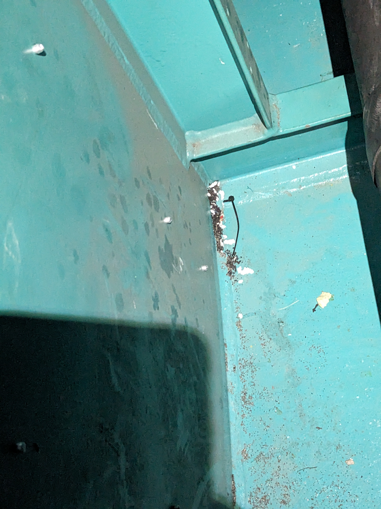
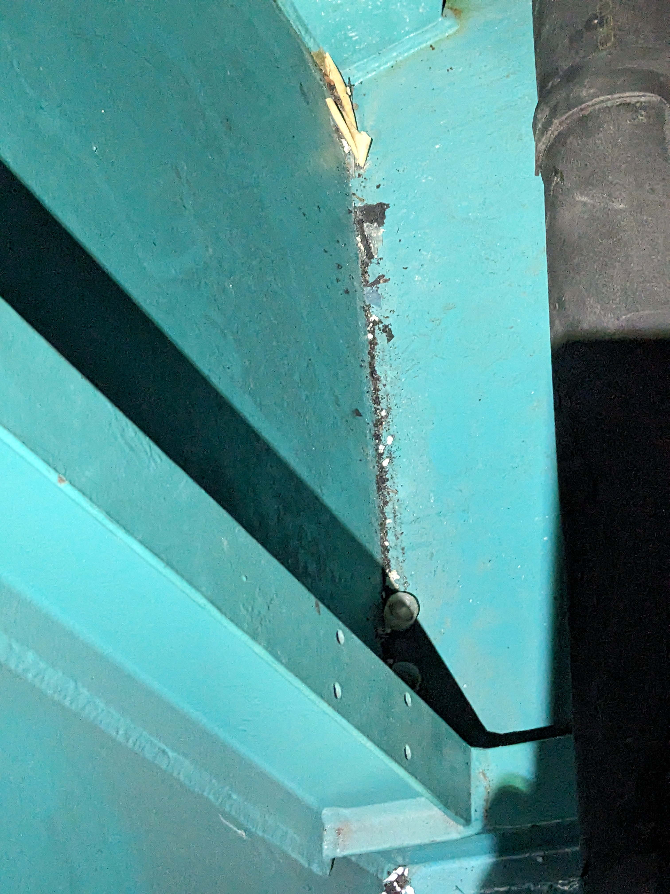
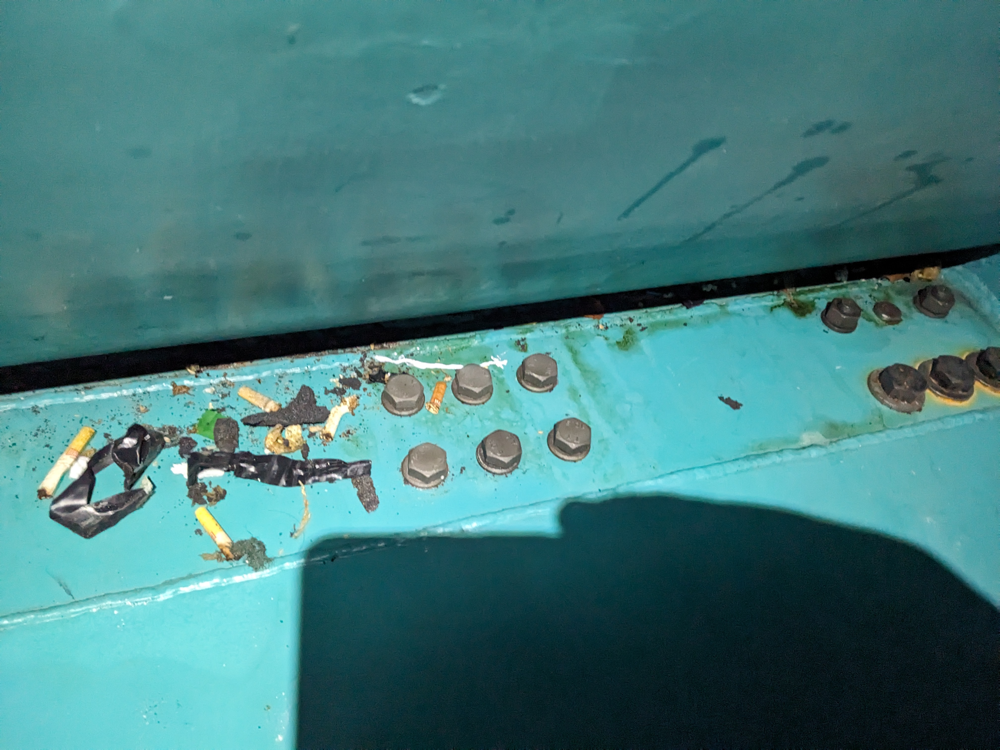
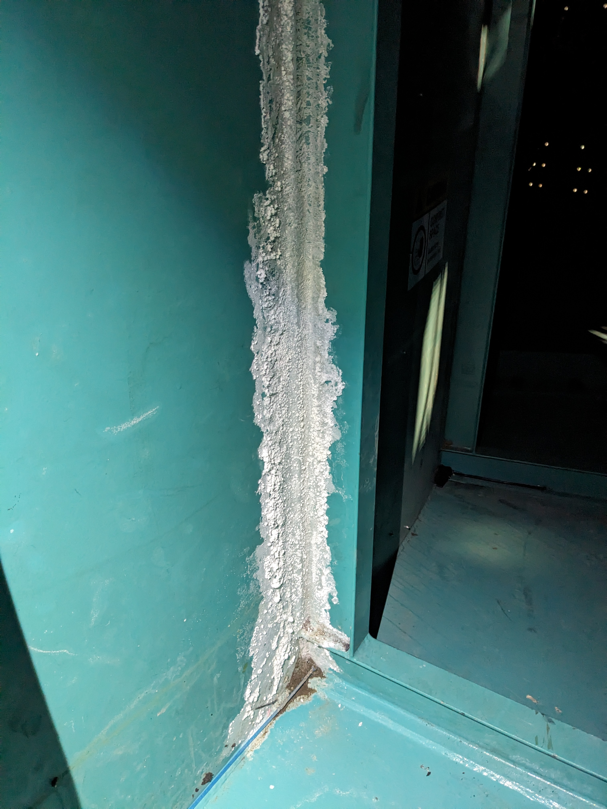
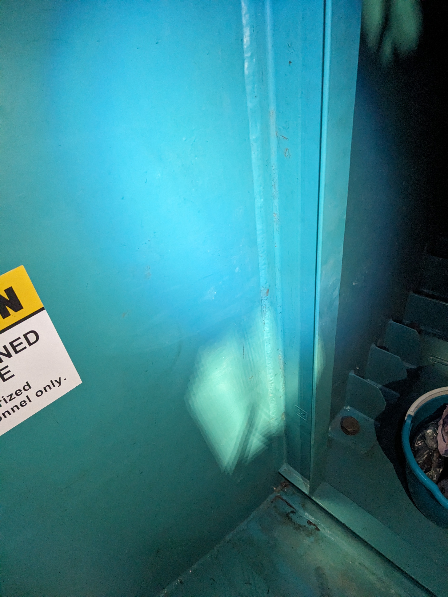
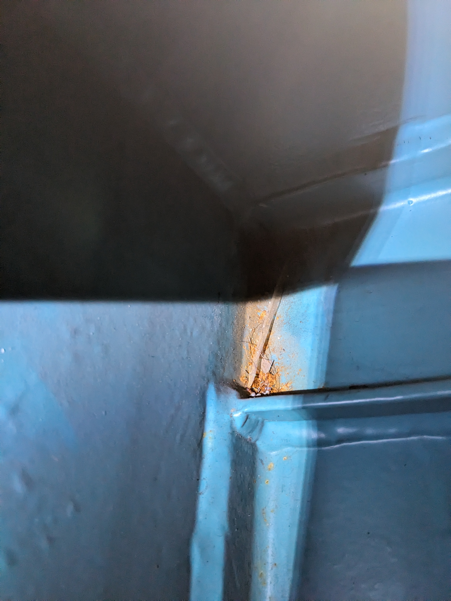
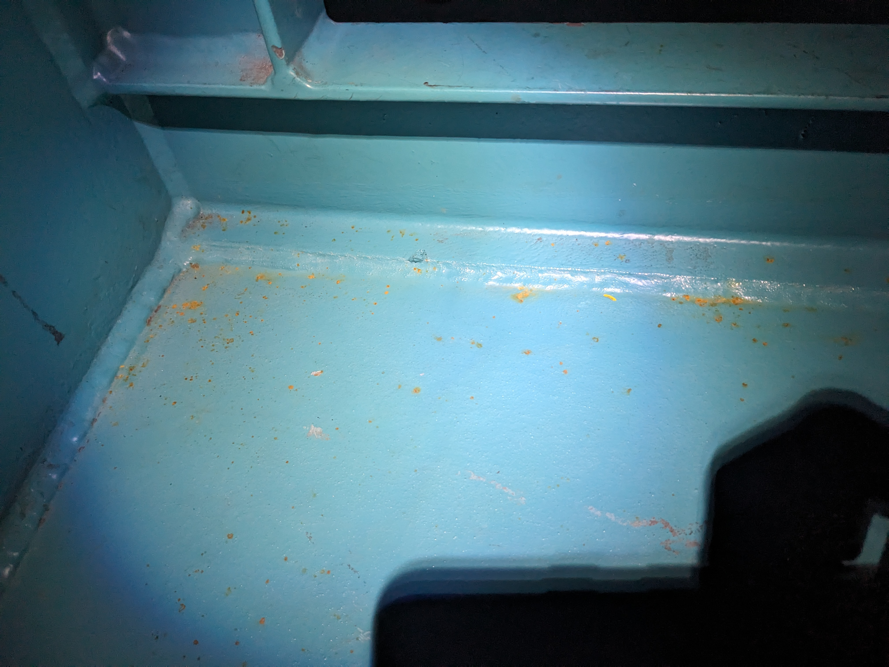
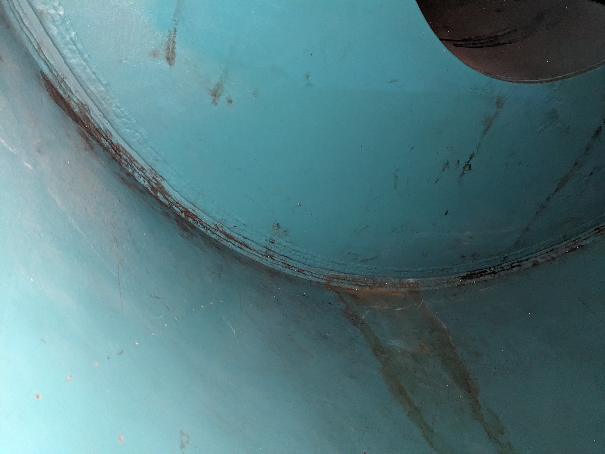
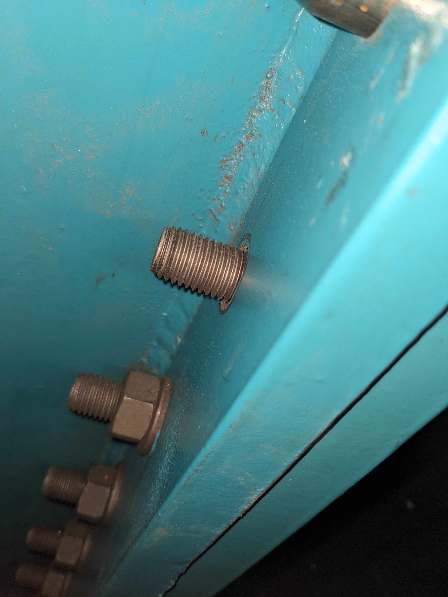
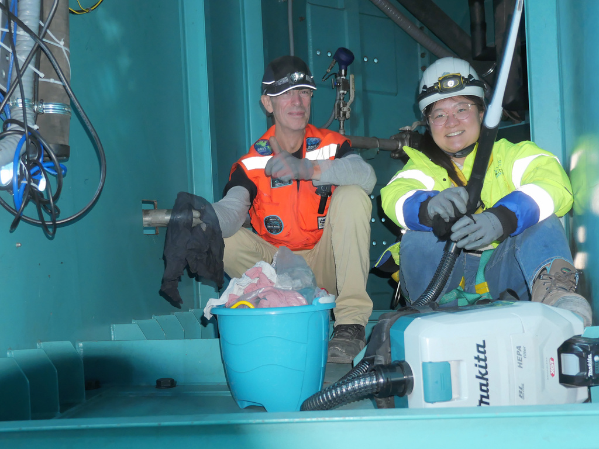

# TMA ring status

```{abstract}
While pulling fibres we noticed a lot of dust and some corrosion in the TMA ring between pylon A and B. 
A cleaning was undertaken and a report was requested. 
```

## Report on status of TMA ring interior

A lot of metallic dust and other debris were found in the ring near Pylon B. 
There <a href="#debris">are photos below.</a>
These were vacuumed out on Sept 5 by entering on the Pylon A side and working from Pylon A to Pylon B. 
On Sept 6 the surfaces were wiped down with cloths and more vacuuming, thanks to Hyeyun for helping.

The most worrying thing was a large amount of <a href="#residue"> white residue </a>  from dynalene on the Pylon A side. 
This came off fairly well with wiping and a little alcohol - the paint seems ok beneath.
The <a href="#cleaner2"> cleaner photo </a> came out blurry sorry but it not vastly different <a href="#cleaner"> the other cleaned column</a>. 
Some glue like residue remains visible in <a href="#cleaner">the second photo</a>. 

Finally there is some rust which perhaps should be dealt with. 
A few corners  <a href="#corosion"> seem to have a build up of residue and/or rust</a>. 
The floor near pylon B <a href="#corosion2"> speckled with rust spots</a>. 
Inside the curve near Pylon A<a href="#corosion3">  there is clear sign of once standing water leaving rust</a> and the black residue mentioned above.


Thanks to Christian Aguilar, Claudio Araya and Isidro Ocaranza for the support. 

## Images supporting the report
<a href="debris">



</a>

The images above show some of the debris and dust encountered when we entered the TMA ring near Pylon A. 

<a name="residue"></a>
<a name="cleaner2">")</a>
<a name="cleaner"></a>

The images above show Dynalene residue and cleaned up space - there remains some black residue like glue which alcohol nor acetone would remove. 
This should not be a problem - it does not appear corrosive and will not generate dust. 

<a name="corosion"></a>
<a name="corosion2"></a>
<a name="corosion3"></a>

The images above show various spots of corrosion which look like rust from water contact. 

<a name="nut"></a>

While cleaning one bolt without a nut was noticed.

<a name="cleaners"></a>
